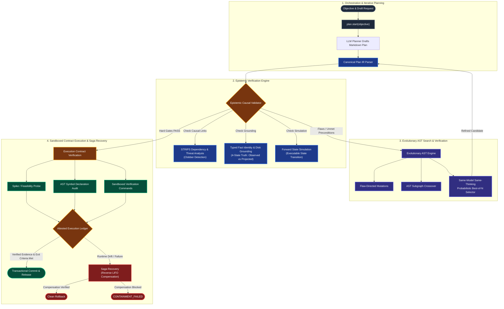
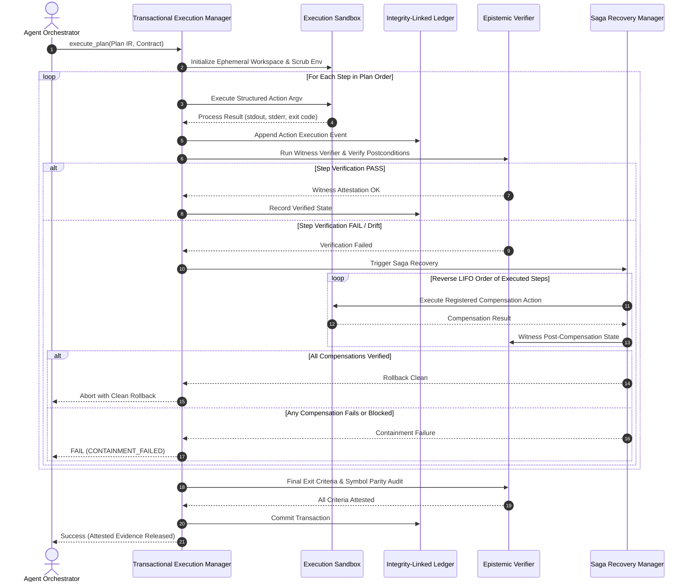

# Prime Agent Plan Mode (`/plan`)

> **Make the plan better before the agent starts doing the work.**

Plan Mode is a formal planning, causal validation, and epistemic verification engine for Prime Agent. Instead of executing the first draft produced by an LLM, `/plan` converts the draft into a structured **Canonical Plan IR**, runs **STRIPS causal validation**, searches the plan space using **evolutionary AST mutations**, tests feasibility via **sandboxed execution contracts**, and enforces **transactional commit with Saga rollback**.

---

## 1. System Architecture



---

## 2. Transactional Sandbox Execution & Saga Recovery



---

## 3. Core Engine Pillars

| Subsystem | Key Components | Purpose & Guarantees |
| :--- | :--- | :--- |
| **Canonical Plan IR & Epistemic Truth** | `plan_mode.ir`<br>`plan_mode.epistemic_validator`<br>`plan_mode.fact_identity` | Separates *projected causal truth* (for plan reasoning) from *empirical observed truth* across 4 truth states (`OBSERVED_TRUE`, `OBSERVED_FALSE`, `ASSUMED_TRUE`, `UNKNOWN`). Validates STRIPS causal links $\langle a_i, p, a_j \rangle$ and detects clobber threats. |
| **Evolutionary AST Search & Verification** | `plan_mode.ir_search`<br>`plan_mode.self_verification`<br>`plan_mode.judges` | Refines plans through flaw-directed AST mutations, subgraph crossover, and same-model same-thinking Best-of-N probabilistic candidate selection. Multi-provider and blind judge ensembles evaluate semantic alignment. |
| **Execution Contracts & Symbol Parity** | `plan_mode.execution_contract`<br>`plan_mode.probing` | Binds plan claims to verifiable real-world evidence: executable feasibility probes, AST symbol audits (detecting missing or undeclared functions/variables), file size/line budgets, and parity checks. |
| **Sandboxed Execution & Integrity Ledger** | `plan_mode.runtime.sandbox`<br>`plan_mode.runtime.ledger`<br>`plan_mode.runtime.executor` | Executes structured `argv` commands with process isolation, environment scrubbing, strict timeouts, and witness attestation. All state changes are recorded in an integrity-linked event ledger. |
| **Saga Compensation & Recovery** | `plan_mode.runtime.transaction`<br>`plan_mode.recovery` | Dispatches registered compensation actions in reverse LIFO order upon failure or runtime drift. Fails closed with `CONTAINMENT_FAILED` if compensation is blocked, unobservable, or unverified. |
| **Cordis Spatiotemporal Composability** | `plan_mode.cordis` | Provides unified context $\Gamma_\infty$, Fiber calculus, dynamic Provider Stacks, and Twisted Monoid $(f_1, g_1) \circ (f_2, g_2) = (f_1 \circ f_2, g_2 \circ g_1)$ LIFO inverse rollback. |

---

## 4. Quick Start & Python API

### Basic Planning Loop
```python
import plan

# 1. Initialize or resume planning session
session = plan.start("Refactor auth pipeline to use JWT with Redis cache", max_rounds=6)

# 2. Assess a candidate plan draft
result = plan.assess(
    session,
    plan_text,
    require_execution_contract=True,
    run_probe=True,
)

# 3. Check convergence status and critiques
if result["status"] == "converged":
    print("Plan is clean, causally valid, and grounded!")
elif result["status"] == "plateaued":
    print("Hard gate failure:", result.get("convergence_checks"))
else:
    print(f"Open critiques ({len(result['critiques'])}):", result["critiques"])
```

### Inherited Best-of-N Self-Verification
```python
# Evaluate multiple candidate drafts using the active runtime model and thinking profile
best_candidate = plan.assess_candidates(
    session,
    drafts=[draft_a, draft_b, draft_c],
    n_evaluations=3,
)
```

### Transactional Plan Execution with Saga Rollback
```python
from plan_mode.runtime import TransactionalExecutionManager, EphemeralWorkspace

workspace = EphemeralWorkspace(base_dir="./workspaces")
manager = TransactionalExecutionManager(workspace=workspace)

# Execute plan with integrity ledger and reverse compensation on failure
outcome = manager.execute(
    plan_ir=canonical_plan_ir,
    capability_registry=registry,
)

if outcome.committed:
    print("Transaction committed with attested evidence:", outcome.evidence)
else:
    print("Transaction aborted and rolled back. Status:", outcome.status)
```

---

## 5. Testing & Verification

```bash
# Run full unit and adversarial test suite
python -m pytest -q

# Run internal engine self-check
python -c "import plan; import plan_mode; res = plan_mode.selfcheck(run_pytest=False); assert res['ok']"

# Run EpiPlanBench benchmark suite
python benchmarks/run_epiplanbench.py
```
